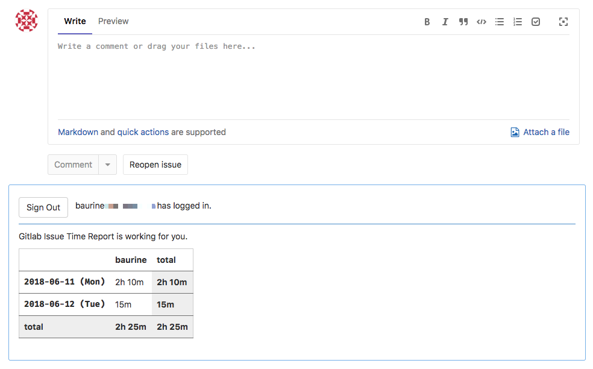
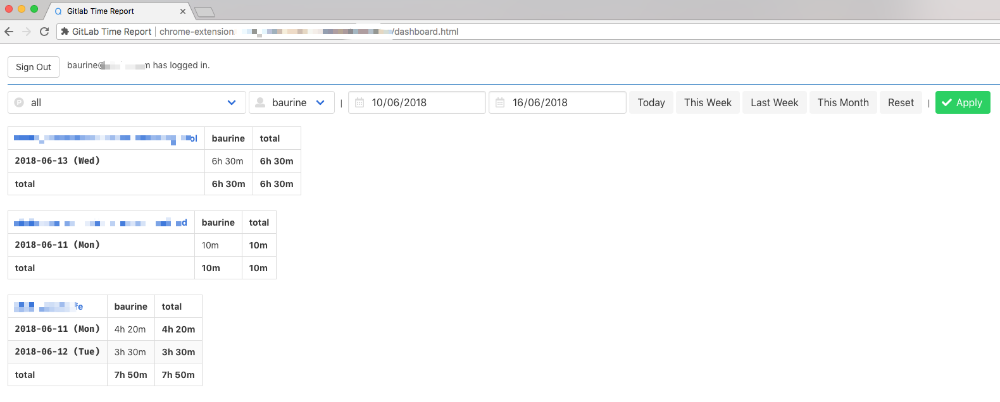
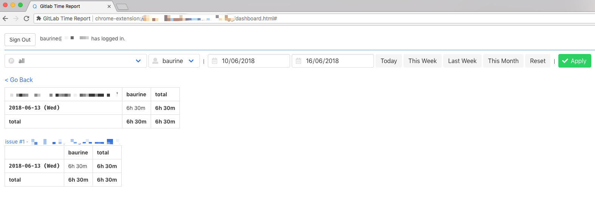

# GitLab Time Report

This is a chrome extension used to generate **realtime** (thanks for Firebase) report for gitlab issues spent time.

1. A realtime report for a single issue in each issue page:

   

1. A realtime report for all projects/users in a dashboard page:

   

1. A realtime report for all issues of a project in a dashboard page:

   

## How to use

TODO

## Notes

TODO:

How to implement this extension step by step, includes:

- Config multiple js entries by Webpack
- Use TypeScript
- Make it as a chrome extension
- Login/Signup with Firebase Auth
- Store data to Firebase Firestore
