# GitLab Time Report Chrome Extension

This is a chrome extension used to generate **realtime** (thanks for Firebase) spent time report for gitlab issues and projects.

Note: the gitlab is deployed and hosted by yourself, for example: <https://gitlab.mycompany.com>, not the public <https://gitlab.com>.

This extension is developed by:

- React
- TypeScript
- Webpack
- Firebase
- Bulma.css

## What can it do

(I use the asterisk to hide the real information.)

1. A realtime report for a single issue in each issue page

   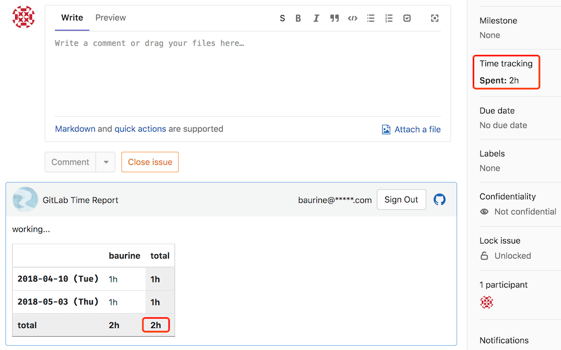

   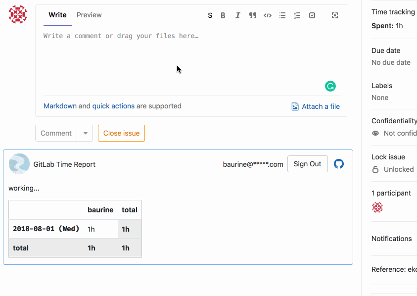

1. A realtime report for all projects/users in a dashboard page

   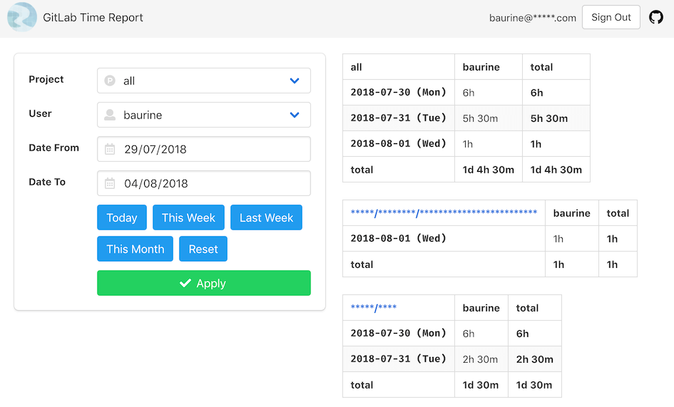

1. A realtime report for all issues of a project in a dashboard page

   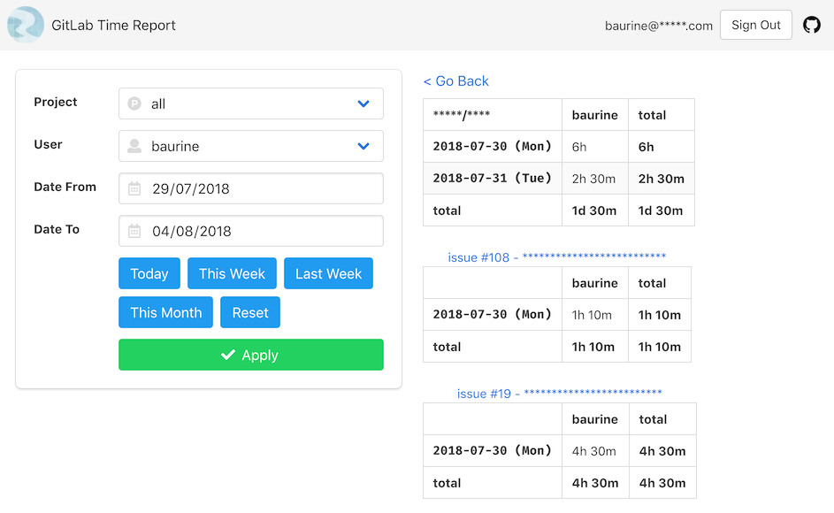

   

1. A shortcut button to log today's spent time to resolve the timezone problem if your gitlab server deploys in another far timezone

   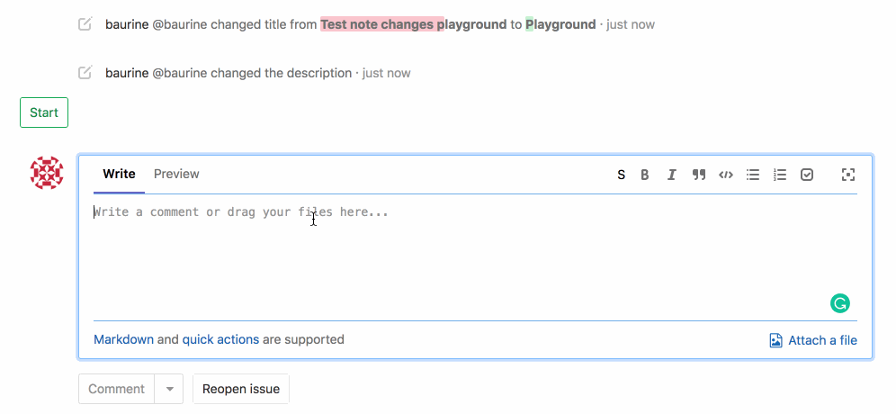

## How does the extension work

The extension is injected into every gitlab issue page, it parses the page content and listens to its changes, stores the spent time logs to Firebase realtime database - Firestore.

## How to start

Because of the data privacy, I think you maybe don't want to store the data to others' server, so this extension won't be published public, it is recommended to build this extension by yourself and use inside the company only.

### Setting Firebase

1. Create a project in Firebase console: <https://console.firebase.google.com/>

   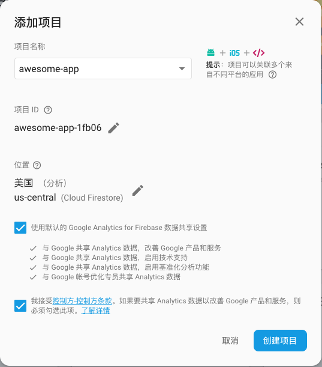

1. Enable "Email/Password" type for authentication

   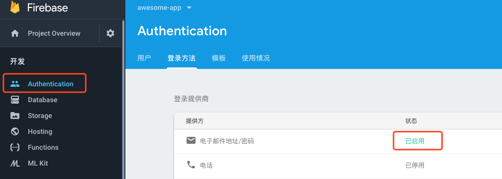

1. Choose Firestore as realtime database

   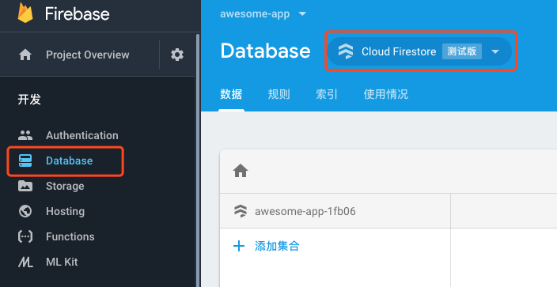

1. Config firestore prerequisite collections and documents

   Add `settings` collection and `allowed_domains`, `versions` documents inside it, you can know their usage from their names.

   `allowed_domains` is used to config which domain this extension should work for, it should be your gitlab server domain.

   `versions` is used to config minimal version this extension support, I use this value to force user to upgrade the extension if its version is lower than `min` value (forgive me).

   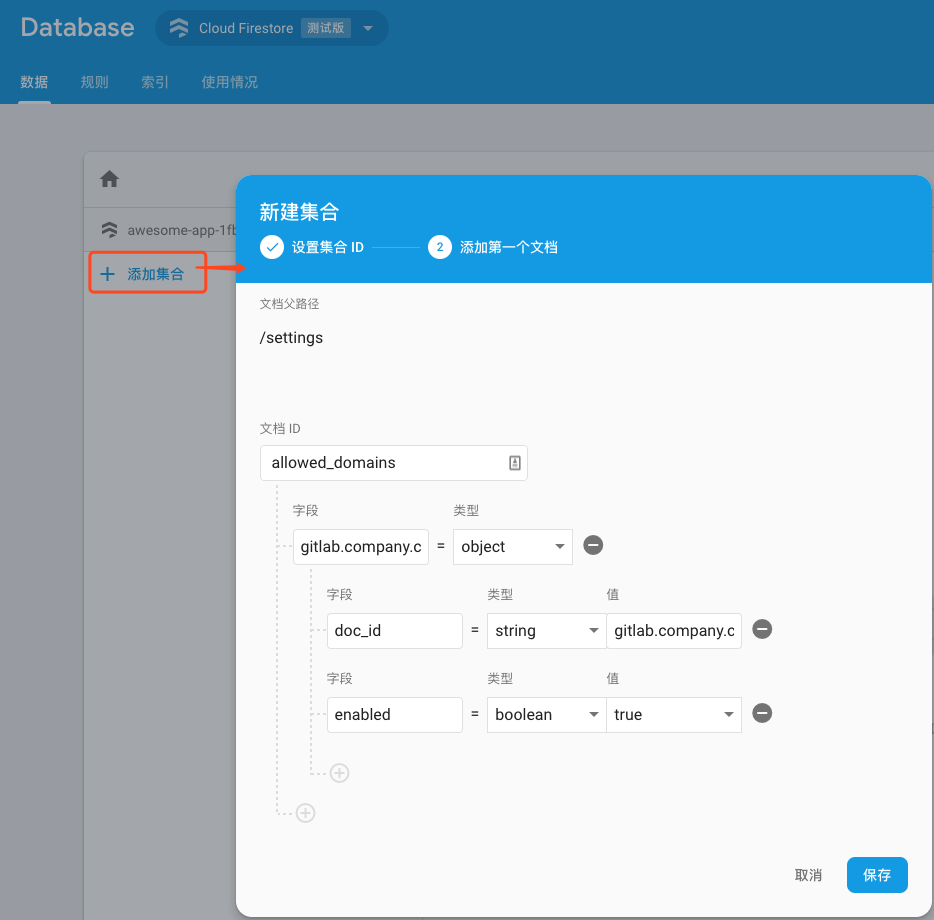

   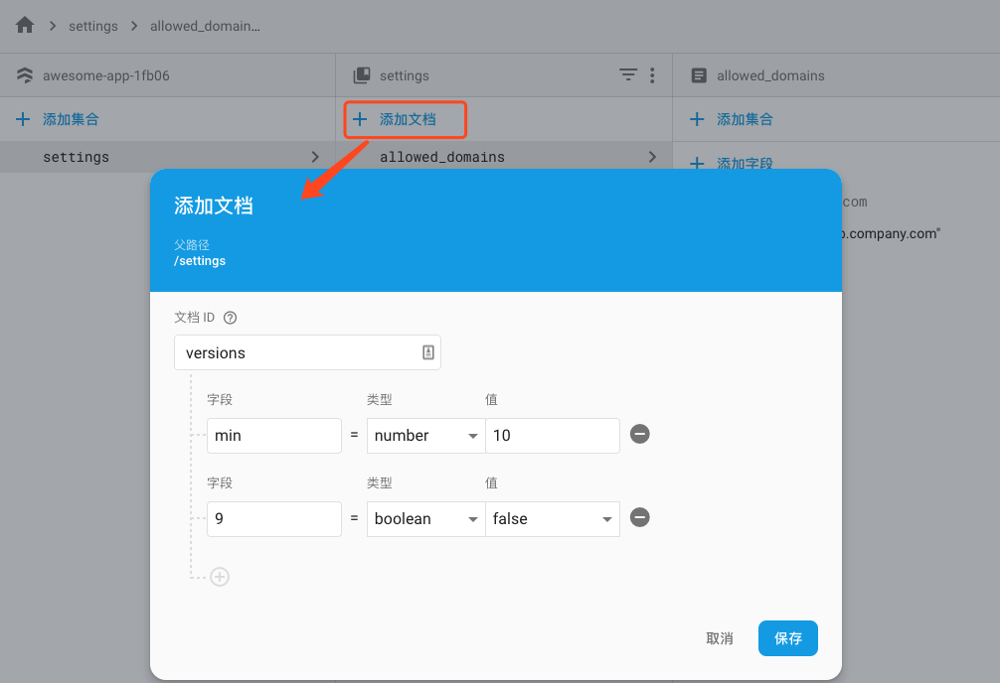

   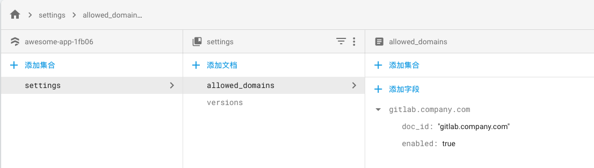

1. Config firestore access rule

   The default firestore access rule is that the data is disabled or enable for all users, we should change it to only can be accessed by users inside the company.

   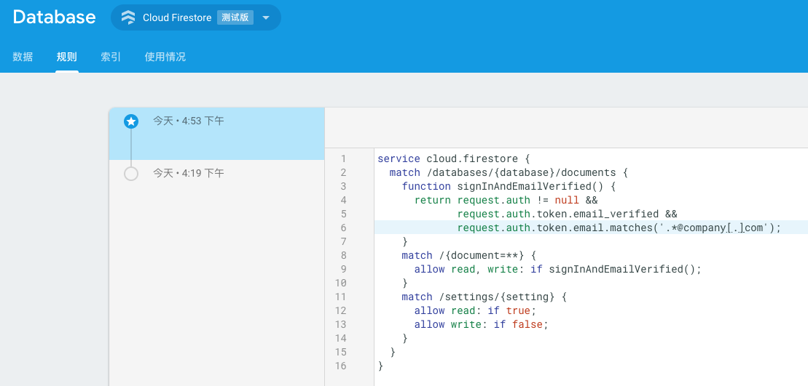

          service cloud.firestore {
            match /databases/{database}/documents {
              function signInAndEmailVerified() {
                return request.auth != null &&
                       request.auth.token.email_verified &&
                       request.auth.token.email.matches('.*@company[.]com');
              }
              match /{document=**} {
                allow read, write: if signInAndEmailVerified();
              }
              match /settings/{setting} {
                allow read: if true;
                allow write: if false;
              }
            }
          }

   Note, you need to change the email format '.*@company[.]com' to yourself email format.

   We config the `settings` collection only can be read but can't be written, for other collections, they only can be read and written by users whose email matches your company's email format.

1. Copy firebase configuration to `chrome_ext/src/js/firebase/firebase-config.ts`

   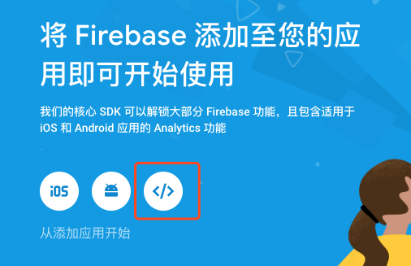

   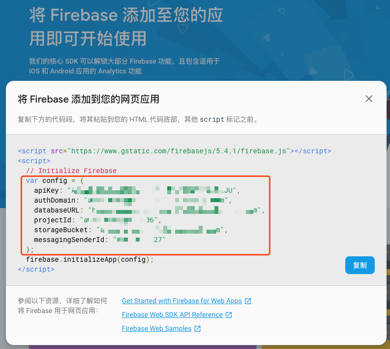

        // firebase-config.ts
        export default {
          apiKey: "***",
          authDomain: "***",
          databaseURL: "***",
          projectId: "***",
          storageBucket: "***",
          messagingSenderId: "***"
        }

### Build and install extension

1. Build

        $ cd chrome_ext
        $ npm install
        $ npm run build

   the extension is generated in `dist` folder, send this folder to your colleagues.

2. Install

   open `chrome://extensions` page, turn on "Developer mode", click "Load unpacked" button, choose the `dist` folder just generated.

   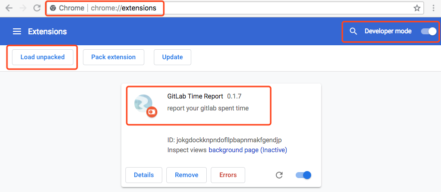

### Use extension

1. Register and login following the instruction after clicking the extension icon

   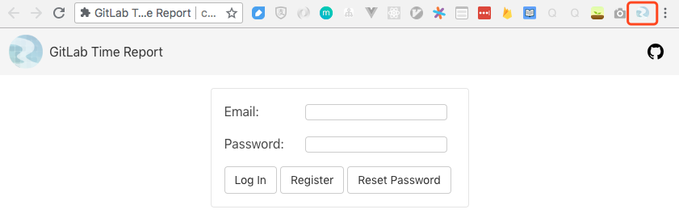

   you have big chance to meet the permission error after the first login, don't worry, just try sign out and login again.

   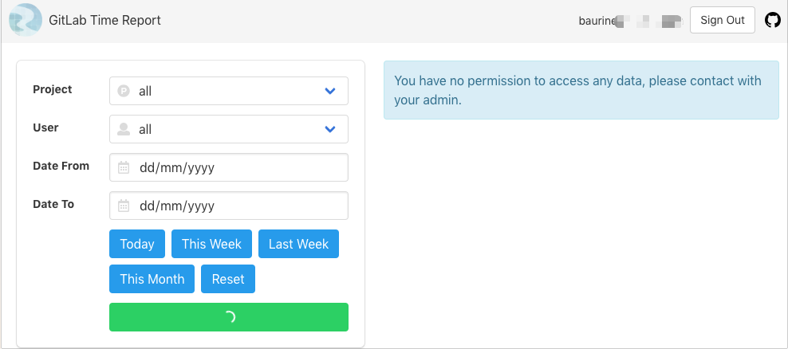

2. It will automatically work in the issue or merge request page

   

   in the dashboard page, you will meet the `The query requires an index` error in the first time query, don't worry, just open the url in the message to create the index.

   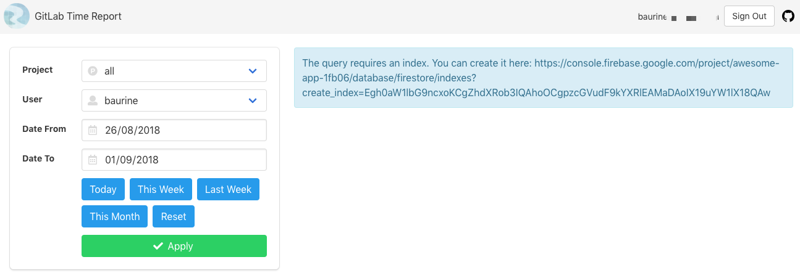

## Notes

- [GitLab Time Report Chrome Extension Note](./notes/chrome-extension-react.md)
  - Config multiple js entries by Webpack
  - Use TypeScript
  - Make it as a chrome extension
  - Login/Signup with Firebase Auth
  - Store/Access data in Firebase Firestore

## Related projects

- [cf-firebase-demo](https://github.com/baurine/cf-firebase-demo)
- [Gitlab Issue Time Tracker Chrome Extension](https://github.com/baurine/gitlab-issue-time-tracker-ext)

## Thanks

Thanks to my colleague @joey who designed the icon for the project.
