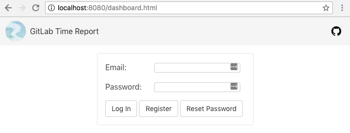

# GitLab Time Report Chrome Extension Note

How to implement this not simple extension by React and TypeScript without create-react-app but Webpack step by step, includes:

- Config multiple js entries by Webpack
- Use TypeScript
- Make it as a chrome extension
- Login/Signup with Firebase Auth
- Store/Access data in Firebase Firestore

粗略记录实现这个插件的关键过程。

## Config multiple js entries by Webpack

我们用 React 来实现这个扩展，网上搜到的用 React 来实现 Chrome extension 的示例都是用 create-react-app 脚手架来写的，但由于这个扩展需要两个 js 文件，一个用来注入到每个 gitlab 的 issue 页面，一个用来展示 dashboard page。但 create-react-app 只能输出一个 js 文件，而通过 `yarn eject` 出来的 webpack.config.js 太复杂了，所以只好手动配置 Webpack，输出两个 js 文件。

这里用的是 Webpack4，整个配置过程在 tag `webpack4_boilerplate` 上可以看到，参考了之前的笔记：

- [Webpack3](https://github.com/baurine/js-study/blob/master/notes/webpack3-note.md)
- [Webpack4](https://github.com/baurine/js-study/blob/master/notes/webpack4-note.md)

多个输出的配置：

    // webpack.config.js
    module.exports = {
      entry: {
        dashboard: './src/js/dashboard.tsx',
        'issue-report': './src/js/issue-report.tsx',
      },
      output: {},
      ...
    }

配置了两个 js 入口，output 选项为空保持默认，这样输出会放到默认文件夹 dist 中，输出的 js 文件名与 entry 中定义的 key 同名。这样从 dashboard.tsx 入口开始的代码将会打包成 dashboard.js，从 issue-report.tsx 入口开始的代码将会打包成 issue-report.js，

其它的配置都是常规配置，比如用 sass-loader, postcss-loader, css-loader 以及 mini-css-extract-plugin 处理 css，用 url-loader 和 file-loader 处理图片和字体文件等。

用 html-webpack-plugin 插件生成 dashboard.html。因为 dashboard.html 需要运行 dashboard.js，所以用 `chunks` 选项声明此 html 需要加载 dashboard.js。

    // webpack.config.js
    module.exports = {
      ...
      plugins: [
        new HtmlWebpackPlugin({
          template: './src/html/template.html',
          filename: 'dashboard.html',
          chunks: ['dashboard'],
          hash: true
        }),
        ...
    }

因为我们是用 React 来实现，所以还要配置处理 `.jsx` 的 loader，我们用 babel-loader 以及相应的 "env" 和 "react" preset 来处理 `.jsx`。

    // webpack.config.js
    module.exports = {
      ...
      module: {
        rules: [
          {
            test: /\.jsx?$/,
            use: 'babel-loader',
            include: /src/,
            exclude: /node_modules/
          },
          ...
    }

    // .babelrc
    {
      "presets": [
        "env",
        "stage-0",
        "react"
      ]
    }

"stage-0" 是用来转换 ES7 语法 (比如 async/await) 的，在这里并不是必需的。

注意，这里所有用到的 npm 包都需要自己手动通过 `npm install` 安装的。

## Use TypeScript

引入 TypeScript 纯粹是想练手，通过实践来熟悉 TypeScript 的使用，一直久闻大名却没有机会使用。事实证明确实好用，后来在工作上的项目中也用上了 TypeScript。

React & TypeScript 的官方配置教程：[React & Webpack](https://www.typescriptlang.org/docs/handbook/react-&-webpack.html)

主要要安装 typescript 和 awesome-typescript-loader，后者是处理 `.tsx` 的 loader。

Webpack 的配置：

    // webpack.config.js
    module.exports = {
      ...
      module: {
        rules: [
          ...
          // All files with a '.ts' or '.tsx' extension will be handled by 'awesome-typescript-loader'.
          { test: /\.tsx?$/, loader: "awesome-typescript-loader" },
    }

TypeScript 的配置文件：

    // tsconfig.json
    {
        "compilerOptions": {
            "outDir": "./dist/",
            "sourceMap": true,
            "strict": true,
            "module": "commonjs",
            "target": "es6",
            "jsx": "react"
        },
        "include": [
            "./src/**/*"
        ]
    }

实际我们使用 TypeScript 后，就只剩 `.tsx` 和 `.ts` 文件了，不再有 `.jsx` 文件，所以处理 `.jsx?$` 的 rule 其实可以不再需要了。

## Make it as a chrome extension

如上一顿操作后，在 `chrome_ext` 目录中执行 `npm run build` 后就会产生输出到 dist 目录中，双击 dashboard.html 就可以在浏览器中打开了，或者执行 `npm run dev` 启动 webpack-dev-server，然后在浏览器中访问 <http://localhost:8080/dashboard.html>，dashboard page 已经可以单独工作了。

但 issue-report.js 不能单独运行，必须要注入到 gitlab issue 页面才能运行。我们来声明一个 manifest.json 把这个应用变成插件。

新建 `public` 目录，在此目录下放置插件所需的 manifest.json 声明文件以及 icons。

这是初版的 manifest.json:

    {
      "name": "GitLab Time Report",
      "version": "0.1.6",
      "version_code": 16,
      "manifest_version": 2,
      "description": "report your gitlab spent time",
      "icons": {
        "128": "icons/circle_128.png"
      },
      "browser_action": {
        "default_icon": "icons/circle_128.png"
      },
      "author": "baurine",
      "options_page": "dashboard.html",
      "content_scripts": [
          {
            "matches": ["<all_urls>"],
            "js": ["issue-report.js"],
            "css": ["issue-report.css"]
          }
      ],
      "permissions": [
        "storage"
      ]
    }

主要是两个选项，`content_scripts` 和 `options_page`，前者用来声明需要在哪些页面注入哪些 js 代码以及用到的 css 代码，因为这个插件支持不同的域名，所以 `matches` 的值是所有 url。`options_page` 用来声明右键单击扩展图标后，在弹出的菜单中选择 options 后要打开的页面，我们用它来进入 dashboard page。

后来我觉得这个需要两步操作才能进入 dashboard page，于是改成了单击鼠标左键后直接打开 dashboard page，但实现起来稍显麻烦一点，先来看新的 manifest.json 吧。

    {
      "name": "GitLab Time Report",
      "version": "0.1.7",
      "version_code": 17,
      "manifest_version": 2,
      "description": "report your gitlab spent time",
      "author": "baurine",
      "icons": {
        "128": "icons/circle_128.png"
      },
      "browser_action": {
        "default_icon": "icons/circle_128.png"
      },
      "content_scripts": [
          {
            "matches": ["<all_urls>"],
            "js": ["issue-report.js"],
            "css": ["issue-report.css"]
          }
      ],
      "background": {
        "scripts": ["background.js"],
        "persistent": false
      },
      "permissions": [
        "storage",
        "tabs"
      ]
    }

我们移除掉了 `options_page` 选项，增加了 `background` 选项，`background` 选项用来声明在后台运行的 js 代码，后台 js 代码不会被注入到 web 页面中，也不需要 html。它可以用来监听浏览器的行为以及调用 Chrome 浏览器的 extension API 来操作浏览器，比如打开一个新的 tab。这里 background.js 的工作就是监听浏览器点击此扩展图标的事件，然后打开 tab 去加载 dashboard.html。

代码很简短，如下所示：

    // background.js
    // ref: https://adamfeuer.com/notes/2013/01/26/chrome-extension-making-browser-action-icon-open-options-page/
    const OPTIONS_PAGE = 'dashboard.html'

    function openOrFocusOptionsPage() {
      const optionsUrl = chrome.extension.getURL(OPTIONS_PAGE)
      chrome.tabs.query({}, function (extensionTabs) {
        let found = false
        for (let i = 0; i < extensionTabs.length; i++) {
          if (optionsUrl === extensionTabs[i].url) {
            found = true
            chrome.tabs.update(extensionTabs[i].id, { "selected": true })
            break
          }
        }
        if (found === false) {
          chrome.tabs.create({ url: OPTIONS_PAGE })
        }
      })
    }

    chrome.browserAction.onClicked.addListener(openOrFocusOptionsPage)

因为 background.js 调用了 chrome.tabs 相关的 API，所以还需要在 `permissions` 选项中增加 `tabs` 的权限声明。`storage` 权限是 Firebase 用来存储登录状态的，不加这个权限则每次打开浏览器插件都处于非登录状态。

最后，还有一件事情要做，当执行 `npm run build` 时，我们需要把 public 目录下的所有文件一同拷贝到 dist 目录中，我们在 Webpack 中使用 `copy-webpack-plugin` 实现。

    // webpack.config.js
    const CopyWebpackPlugin = require('copy-webpack-plugin')

    module.exports = {
      ...
      plugins: [
        ...
        new CopyWebpackPlugin([
          { from: './public', to: '' }
        ])
      ...
    }

## Login/Signup with Firebase Auth

再总结一下 Firebase 用户认证相关 API 的使用，看官方文档也行。示例代码在 `chrome_ext/src/js/components/AuthBox.tsx` 中。

首先取到 firebaseAuth 对象：

    // chrome_ext/src/js/firebase/index.ts
    const firebase = require('firebase/app')
    require('firebase/auth')

    firebase.initializeApp(firebaseConfig)
    const firebaseAuth = firebase.auth()

用邮箱密码注册：

    firebaseAuth.createUserWithEmailAndPassword(email, password)

用邮箱密码登录：

    firebaseAuth.signInWithEmailAndPassword(email, password)

登出：

    firebaseAuth.signOut()

监听用户登录登出状态的变化 (如果登录成功，在回调中得到 user 对象，否则 user 为 null，登出后 user 也为 null)：

    firebaseAuth.onAuthStateChanged((user: any) => {
      this.setState({user, loading: false, message: ''})
    })

登录后如果发现用户的邮箱未验证，则要求验证邮箱 (取决于你自己的需求)：

    user.sendEmailVerification()

重置密码：

    firebaseAuth.sendPasswordResetEmail(email)

## Store data to Firebase Firestore

Firestore 是包含在 Firebase 组件中的新的实时数据库，是 NoSQL 的一种，和 MongoDB 类似，也有 collection 和 document 的概念，collection 类似关系型数据库中的表，而 document 相当于表中的一条记录。但 Firestore 有一点和 MongoDB 有一样，Firestore 的 document 可以嵌套子 collection (但应该有嵌套的层级限制。)

数据库无非是增删改查，那就让我们看一下如何对 Firestore 进行 CRUD。示例代码主要在 `chrome_ext/src/js/components/IssueReport.tsx` 和 `TotalReport.tsx` 中。

(需要注意的是，Firestore 并没有使用 RESTful API。)

首先取到 firebaseDb 对象：

    const firebase = require('firebase/app')
    require('firebase/firestore')

    firebase.initializeApp(firebaseConfig)
    const firebaseDb = firebase.firestore()

### 创建一个 document

document 只能从属于 collection，但并不需要先创建一个 collection。如果你往某个名字的 collection 中添加第一个 document，那么此 colletion 会被自动创建；如果某个 collection 中的所有 document 被删光了，这个 collection 会被自动删除。所以并没有创建和删除 collection 的 API。

所以创建 document 之前，我们先要指定 collection，我们用 `firebaseDb.collection(collection_name)` 来得到相应的 collection 引用，它的类型是 CollectionRef，在 collection 引用对象上调用 `add()` 方法来创建从属于此 collection 的 document。示例：

    firebaseDb.collection('users')
      .add({
        name: 'spark',
        gender: 'male'
      })
      .then((docRef: DocumentRef) => console.log(docRef.id)) // docRef.gender ? undefined
      .catch(err => console.log(err))

`add()` 方法的返回值是一个 `Promise<DocumentRef>`，DocumentRef 是 document 的引用，并不直接包含此 document 相应的数据，比如它并没有一个 `gender` 的属性，它只包含 `id` 属性。

有了 id 以后，我们之后就可以通过 `firebaseDb.collection('users').doc(id)` 来取得相应的 document 的引用 (当然，在这里是多此一举，因为上面的返回值就已经是 document ref 了)。

另外，你可能有疑惑，`add()` 方法为什么只返回 document ref，而不像 RESTful API，返回它的整个对象呢，那我要去访问 name 和 gender 属性的值怎么办？

我想是因为在 `add()` 中的值都是已知的，我们所缺的也就仅仅是 id，所以最后返回值只包括了 id。所以可以看到后面在调用 `set()` 和 `update()` 方法时，返回值是 void，连 id 都省了，因为 id 都已经是已知的了。

用 `add()` 方法创建的 document，其 id 是由 Firestore 产生的，是一长串没有规律的字符串，类似 UUID (就像是 MongoDB 中的 ObjectID)。如果我们想使用我们指定的 id 呢。比如这里我们想在 users collection 中创建一个 id 为 spark 的 user。

首先，我们用 `firebaseDb.collection('users').doc('spark')` 来得到 document 引用 (这个 document 实际存不存在并没有关系)，然后，我们在 document ref 对象上调用 `set()` 方法填充值。

    firebaseDb.collection('users')
      .doc('spark')
      .set({
        name: 'spark',
        gender: 'male'
      })
      .then(() => console.log('add successful'))
      .catch(err => console.log(err))

正如前面所说，在调用 `set()` 方法创建 document 时，id 和值都是我们已知的，所以并不需要返回值，只需要知道成功或失败即可。

现在我们已经了解了两种数据类型：CollectionRef 和 DocumentRef，前者是对某个 collection 的引用，而后者是对某个 document 的引用。

你可能还是好奇，那到底怎么才能拿到一个完整的 document 数据呢？别着急，我们会在查询一节讲到。

### 删除一个 document

删除就比较简单了，首先拿到 document 引用，然后调用 `delete()` 方法即可，返回值为 `Promise<void>`。

示例，删除刚才创建的 spark 用户：

    firebaseDb.collection('users')
      .doc('spark')
      .delete()
      .then(() => console.log('delete successful'))
      .catch(err => console.log(err))

那如果在客户端我想同时删除多个 document，或者删除整个 collection 呢，很遗憾的或者说很奇芭的一点是，Firestore 并不支持，除非你在控制台操作或通过 Admin API 删除。我们只能通过循环遍历，依次取得要删除的 document 引用对象，调用它们的 `delete()` 方法，略蛋疼，可能是出于数据安全的考虑吧，毕竟这是在客户端直接操作数据库。

### 修改一个 document

类似 `set()` 和 `delete()` 方法，先取得 document 的引用，然后调用 `update()` 方法，返回值是 `Promise<void>`。

    firebaseDb.collection('users')
      .doc('spark')
      .update({
        name: 'spark001',
      })
      .then(() => console.log('update successful'))
      .catch(err => console.log(err))

`update()` 中没有指定的字段，其值保持原样。

同时修改多个 document？还是别想了吧。

### 查询 document

查询是重头戏。

创建 / 删除 / 修改 都只能对一个 document 进行操作，查询可不行。

#### 查询一个 document

首先，回到前面的问题，当我们通过 `firebaseDb.collection(colletion_name).doc(id)` 拿到一个 document 的引用后，怎么取得其中真正的数据。DocumentRef 对象有一个 `get()` 方法，它的返回值是 `Promise<DocumentSnapshot>`，再对 DocumentSnapshot 对象调用 `data()` 方法，才能真正访问到其中的数据，`data()` 方法的返回值是 DocumentData 类型对象。但是访问之前，我们还要判断一下这个 document 是不是真的存的，因为我们可以引用的是一个不存在的，空的 document。

示例代码：

    firebaseDb.collection('users')
      .doc('spark')
      .get()
      .then((docSnapshot: DocumentSnapshot) => {
        if (docSnapshot.exists) {
          console.log('user:': docSnapshot.data())  // {name: 'spark001', gender: 'male'}
        } else {
          console.log('no this user')
        }
      })
      .catch((err: Error) => console.log(err))

#### 查询多个 document

如果我们查询的是多个 document 呢，比如我们返回某个集合中所有的 document，或者是符合某些条件的 document，比如在 users 表中查找 gender 为 male 的用户。

示例，返回集合中的所有 document：

    firebaseDb.collection('users')
      .get()

返回集合中符合条件的 document：

    firebaseDb.collection('users')
      .where('gender', '==', 'male')
      .get()

对 CollectionRef 调用 `where()` 查询条件方法，将得到 Query 对象。对 CollectionRef 和 Query 对象调用 `get()` 方法，都将得到 `Promise<QuerySnapshot>` 对象。

QuerySnapshot 对象是 DocumentSnapshot 的集合，它有一个 forEach 方法用来遍历，从而可以依次取得其它的 DocumentSnapshot 对象，再从 DocumentSnapshot 中取得 DocumentData 对象，我们真正需要的数据。

来看一个本项目中实际的例子：

    // TotalReport.tsx
    loadUsers = (domain: string) => {
      return firebaseDb.collection(dbCollections.DOMAINS)
        .doc(domain)
        .collection(dbCollections.USERS)
        .orderBy('username')
        .get()
        .then((querySnapshot: any) => {
          let users: IProfile[] = [DEF_USER]
          querySnapshot.forEach((snapshot: any)=>users.push(snapshot.data()))
          this.setState({users})
          this.autoChooseUser(users)
        })
    }

### 实时查询

前面我们用 `get()` 方法实现了一次性的查询，而 Firestore 是一个实时数据库，这意味着，我们可以监听数据库的变化，如果有符合条件的数据发生变化，我们将接收到变化通知，从而实现实时的查询。

Firestore 使用 `onSnapshot()` 方法来监听数据变化，可以作用在 DocumentRef，CollectionRef，Query 对象上。它接收回调函数作为参数，回调函数的参数类型和 `get()` 方法返回的 Promise 中包含的数据类型相同，分别是 DocumentSnapshot 和 QuerySnapshot。

`onSnapshot()` 调用以后，我们需要在合适的时候取消监听，否则造成资源浪费。`onSnapshot()` 的返回值是一个函数，调用这个函数就可以取消监听。

来自本项目的真实示例代码：

    // TotalReport.tsx
    componentWillUnmount() {
      this.unsubscribe && this.unsubscribe()
    }

    queryTimeLogs = () => {
      this.unsubscribe = query.onSnapshot((snapshot: any) => {
          let timeLogs: ITimeNote[] = []
          snapshot.forEach((s: any) => timeLogs.push(s.data()))
          this.aggregateTimeLogs(timeLogs)
        }, (err: any) => {
          this.setState({message: CommonUtil.formatFirebaseError(err), loading: false})
        })
        ...
    }

最后，如果你觉得这个例子对于理解 Firebase 的使用过于复杂的话，可以看这个例子：[cf-firebase-demo](https://github.com/baurine/cf-firebase-demo)，用 Firebase 实现的 TodoList，核心代码不到一百行。

## 后记

当初想写这个扩展的动机，是源于我们公司将项目管理平台从 Redmine 切换到了 GitLab，GitLab 相比 Redmine 确实更加 fashion，但它有一个我们很需要的功能却不完善，就是时间统计报表，我们需要为每一个 issue 记录所花费的时间，在 Redmine 上，PM 可以方便地查询和生成每个人在某个时间段花费的时间报表，但 GitLab 不行，因此 PM 很头疼，于是想到写这个插件来减轻他们的痛苦。

我们试过一些第三方工具，比如 [gtt](https://github.com/kriskbx/gitlab-time-tracker)，但这些工具一是耗时很长 (都是通过 GitLab API 先遍历 projects，再遍历 project 下的 issues，最后遍历 issue 下的 time notes)，二是对于 PM 来说，使用太复杂 (gtt 是一个命令行工具，而且参数众多)。

当然，其实最后 PM 们也没用上我这个工具，因为后来发现了更简单的办法，通过查阅 GitLab 的源码，发现实际上在 GitLab 的 database 中，是有一个叫 timelogs 的表，直接存放了 time notes，但是很遗憾 GitLab 并没有开放任何 API 去访问这个表，于是我们写了一个 rails 的项目，直接去访问 GitLab 的 database 来生成报表 (这个项目还在内部完善中)。

虽然如此，我还是通过这个项目学习到了很多，学习到了 TypeScript 的使用，Firebase 的使用，以及 Bulma.css 的使用，加深了对 Webpack 的理解。我会把它作为我的 side project 继续优化。
